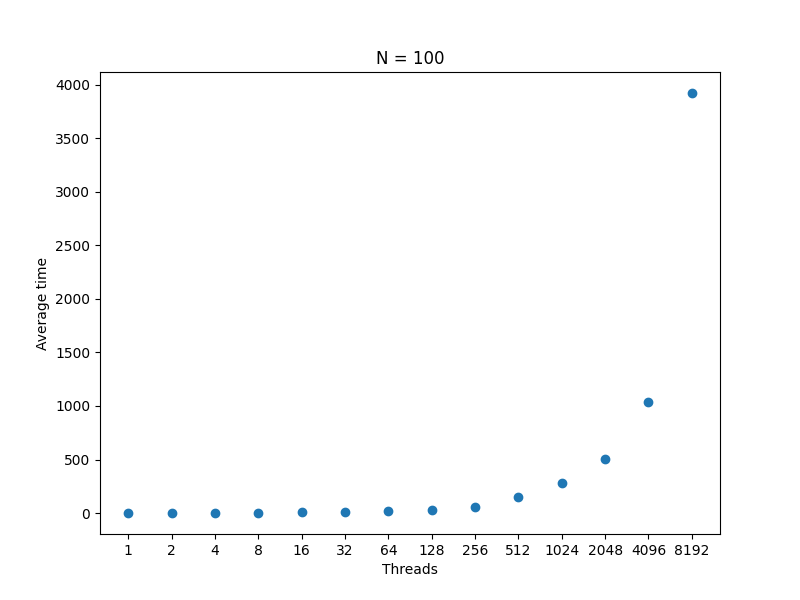
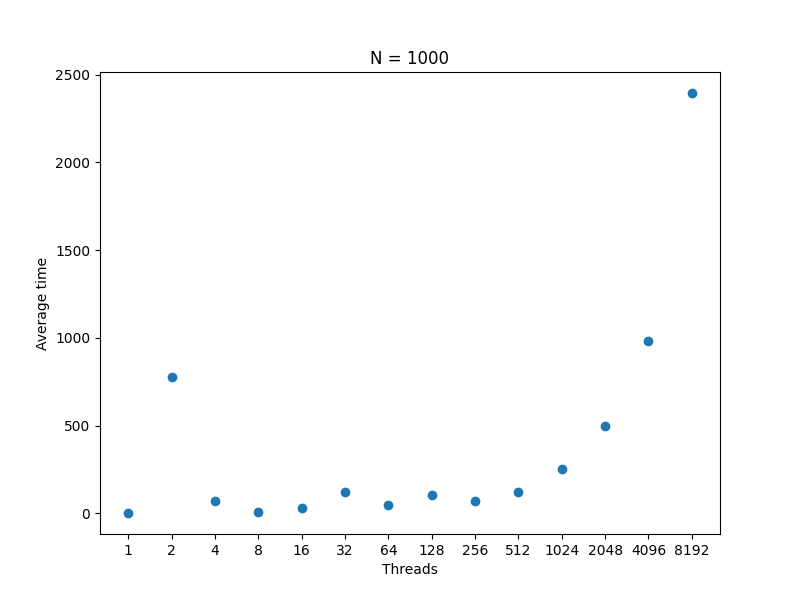
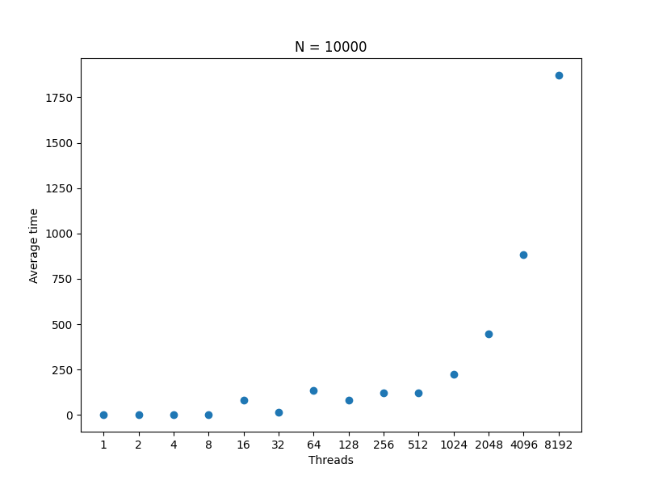
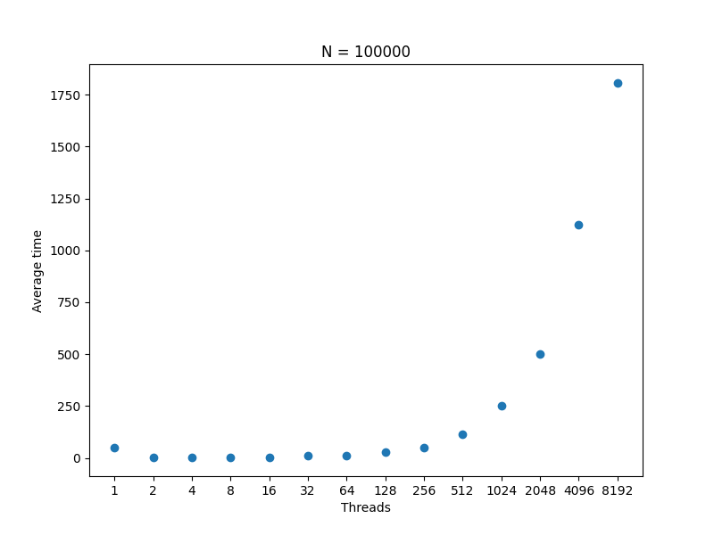
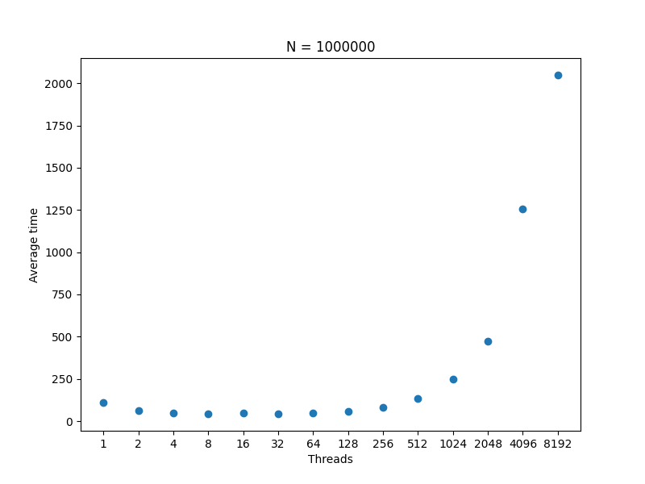
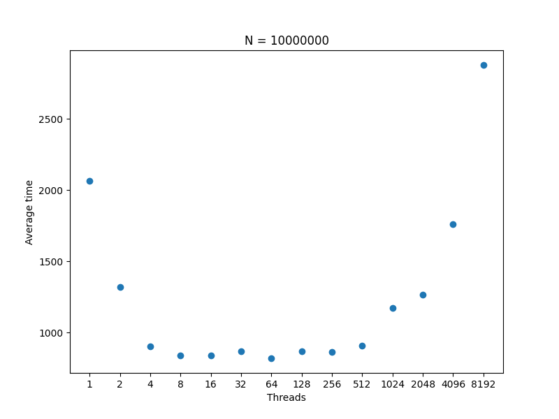
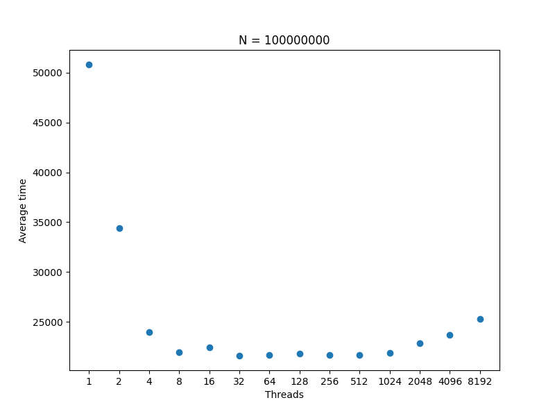

# Performance Results
# Chunks method

## N = 100

| Threads | Average Time |
|---------|--------------|
| 1       | 1ms          |
| 2       | 1ms          |
| 4       | 1ms          |
| 8       | 2ms          |
| 16      | 6ms          |
| 32      | 9ms          |
| 64      | 16ms         |
| 128     | 25ms         |
| 256     | 57ms         |
| 512     | 148ms        |
| 1024    | 278ms        |
| 2048    | 507ms        |
| 4096    | 1040ms       |
| 8192    | 3922ms       |

## N = 1,000

| Threads | Average Time |
|---------|--------------|
| 1       | 2ms          |
| 2       | 775ms        |
| 4       | 68ms         |
| 8       | 6ms          |
| 16      | 29ms         |
| 32      | 120ms        |
| 64      | 48ms         |
| 128     | 105ms        |
| 256     | 73ms         |
| 512     | 124ms        |
| 1024    | 252ms        |
| 2048    | 500ms        |
| 4096    | 981ms        |
| 8192    | 2396ms       |

## N = 10,000

| Threads | Average Time |
|---------|--------------|
| 1       | 2ms          |
| 2       | 4ms          |
| 4       | 2ms          |
| 8       | 4ms          |
| 16      | 82ms         |
| 32      | 17ms         |
| 64      | 134ms        |
| 128     | 81ms         |
| 256     | 122ms        |
| 512     | 120ms        |
| 1024    | 225ms        |
| 2048    | 448ms        |
| 4096    | 885ms        |
| 8192    | 1872ms       |

## N = 100,000

| Threads | Average Time |
|---------|--------------|
| 1       | 52ms         |
| 2       | 4ms          |
| 4       | 3ms          |
| 8       | 3ms          |
| 16      | 4ms          |
| 32      | 12ms         |
| 64      | 13ms         |
| 128     | 27ms         |
| 256     | 50ms         |
| 512     | 114ms        |
| 1024    | 253ms        |
| 2048    | 503ms        |
| 4096    | 1123ms       |
| 8192    | 1806ms       |

## N = 1,000,000

| Threads | Average Time |
|---------|--------------|
| 1       | 108ms        |
| 2       | 61ms         |
| 4       | 46ms         |
| 8       | 43ms         |
| 16      | 46ms         |
| 32      | 43ms         |
| 64      | 50ms         |
| 128     | 59ms         |
| 256     | 81ms         |
| 512     | 136ms        |
| 1024    | 249ms        |
| 2048    | 474ms        |
| 4096    | 1254ms       |
| 8192    | 2049ms       |

## N = 10,000,000

| Threads | Average Time |
|---------|--------------|
| 1       | 2062ms       |
| 2       | 1318ms       |
| 4       | 904ms        |
| 8       | 841ms        |
| 16      | 841ms        |
| 32      | 868ms        |
| 64      | 821ms        |
| 128     | 870ms        |
| 256     | 865ms        |
| 512     | 909ms        |
| 1024    | 1175ms       |
| 2048    | 1267ms       |
| 4096    | 1763ms       |
| 8192    | 2877ms       |

## N = 100,000,000

| Threads | Average Time |
|---------|--------------|
| 1       | 50818ms      |
| 2       | 34432ms      |
| 4       | 23999ms      |
| 8       | 21960ms      |
| 16      | 22443ms      |
| 32      | 21614ms      |
| 64      | 21703ms      |
| 128     | 21857ms      |
| 256     | 21677ms      |
| 512     | 21718ms      |
| 1024    | 21890ms      |
| 2048    | 22893ms      |
| 4096    | 23671ms      |
| 8192    | 25286ms      |

