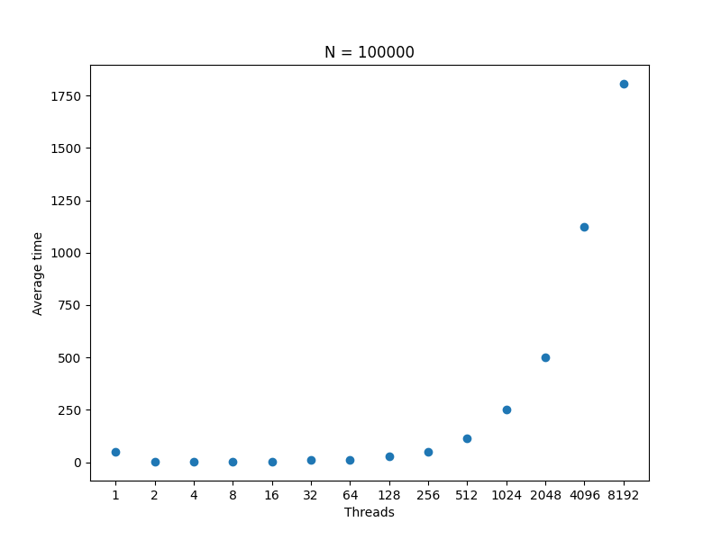

# Performance Results

## N = 100

| Threads | Average Time |
|---------|--------------|
| 1       | 0ms          |
| 2       | 0ms          |
| 4       | 2ms          |
| 8       | 2ms          |
| 16      | 4ms          |
| 32      | 7ms          |
| 64      | 16ms         |
| 128     | 41ms         |
| 256     | 50ms         |
| 512     | 108ms        |
| 1024    | 221ms        |
| 2048    | 419ms        |

## N = 1000

| Threads | Average Time |
|---------|--------------|
| 1       | 1ms          |
| 2       | 0ms          |
| 4       | 1ms          |
| 8       | 1ms          |
| 16      | 2ms          |
| 32      | 5ms          |
| 64      | 13ms         |
| 128     | 25ms         |
| 256     | 52ms         |
| 512     | 100ms        |
| 1024    | 197ms        |
| 2048    | 435ms        |

## N = 10000

| Threads | Average Time |
|---------|--------------|
| 1       | 1ms          |
| 2       | 1ms          |
| 4       | 1ms          |
| 8       | 2ms          |
| 16      | 2ms          |
| 32      | 5ms          |
| 64      | 16ms         |
| 128     | 26ms         |
| 256     | 69ms         |
| 512     | 127ms        |
| 1024    | 274ms        |
| 2048    | 446ms        |

## N = 100000

| Threads | Average Time |
|---------|--------------|
| 1       | 12ms         |
| 2       | 9ms          |
| 4       | 7ms          |
| 8       | 7ms          |
| 16      | 7ms          |
| 32      | 9ms          |
| 64      | 14ms         |
| 128     | 28ms         |
| 256     | 71ms         |
| 512     | 112ms        |
| 1024    | 211ms        |
| 2048    | 424ms        |

## N = 1000000

| Threads | Average Time |
|---------|--------------|
| 1       | 305ms        |
| 2       | 199ms        |
| 4       | 139ms        |
| 8       | 134ms        |
| 16      | 144ms        |
| 32      | 146ms        |
| 64      | 149ms        |
| 128     | 173ms        |
| 256     | 222ms        |
| 512     | 250ms        |
| 1024    | 359ms        |
| 2048    | 703ms        |

## N = 10000000

| Threads | Average Time |
|---------|--------------|
| 2       | 6381ms       |
| 4       | 4329ms       |
| 8       | 4045ms       |
| 16      | 3884ms       |
| 32      | 3815ms       |
| 64      | 3824ms       |
| 128     | 3885ms       |
| 256     | 3855ms       |
| 512     | 3928ms       |
| 1024    | 4094ms       |
| 2048    | 4380ms       |
| 4096    | 5061ms       |
| 8192    | 6956ms       |
| 16384   | 10148ms      |

## N = 100000000

| Threads | Average Time |
|---------|--------------|
| 2       | 160905ms     |
| 4       | 106176ms     |
| 8       | 94980ms      |
| 16      | 95150ms      |
| 32      | 93232ms      |
| 64      | 93612ms      |
| 128     | 92616ms      |
| 256     | 90520ms      |
| 512     | 90171ms      |
| 1024    | 89448ms      |
| 2048    | 90859ms      |
| 4096    | 91669ms      |
| 8192    | 92434ms      |
| 16384   | 96146ms      |

