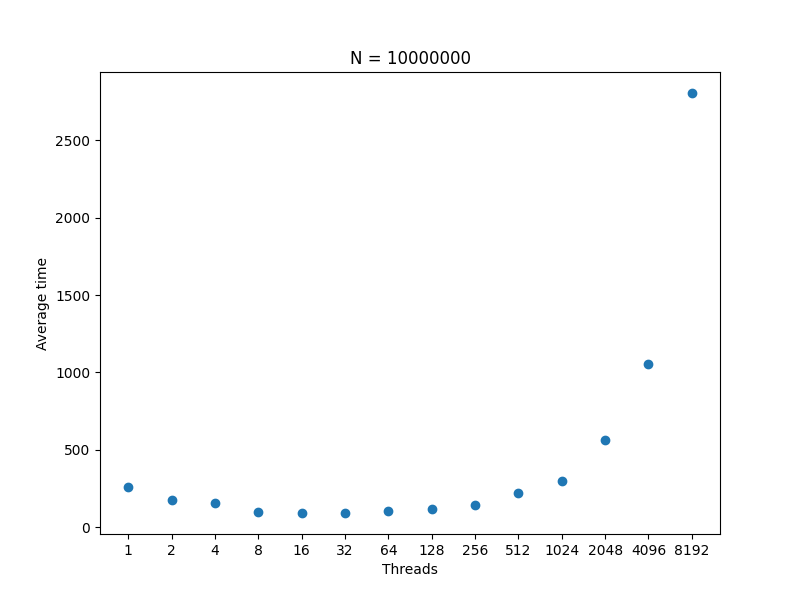
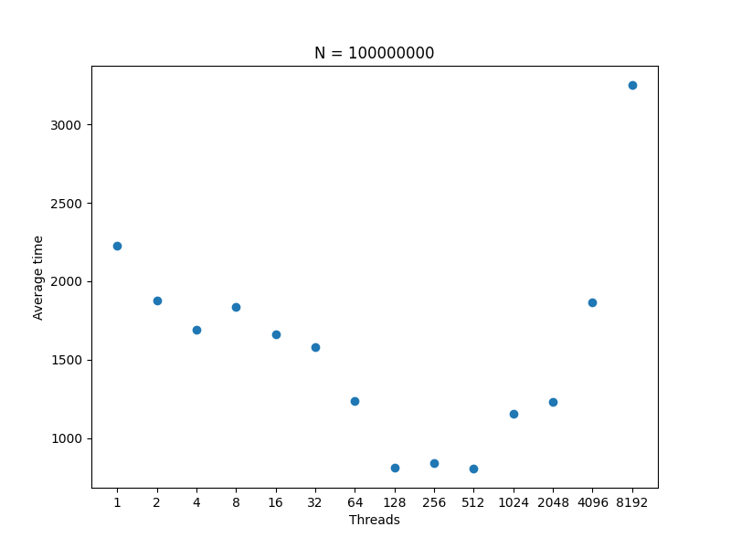

# Performance Results
=======================

## N = 10,000,000

| Threads | Average Time |
|---------|--------------|
| 1       | 751ms        |
| 2       | 585ms        |
| 4       | 730ms        |
| 8       | 780ms        |
| 16      | 815ms        |
| 32      | 894ms        |
| 64      | 831ms        |
| 128     | 980ms        |
| 256     | 936ms        |
| 512     | 956ms        |
| 1024    | 1192ms       |
| 2048    | 1554ms       |
| 4096    | 2710ms       |
| 8192    | 4794ms       |

## N = 100,000,000

| Threads | Average Time |
|---------|--------------|
| 1       | 7037ms       |
| 2       | 6714ms       |
| 4       | 7045ms       |
| 8       | 7639ms       |
| 16      | 7829ms       |
| 32      | 7362ms       |
| 64      | 7513ms       |
| 128     | 7307ms       |
| 256     | 7396ms       |
| 512     | 7918ms       |
| 1024    | 7442ms       |
| 2048    | 8286ms       |
| 4096    | 8818ms       |
| 8192    | 10051ms      |

