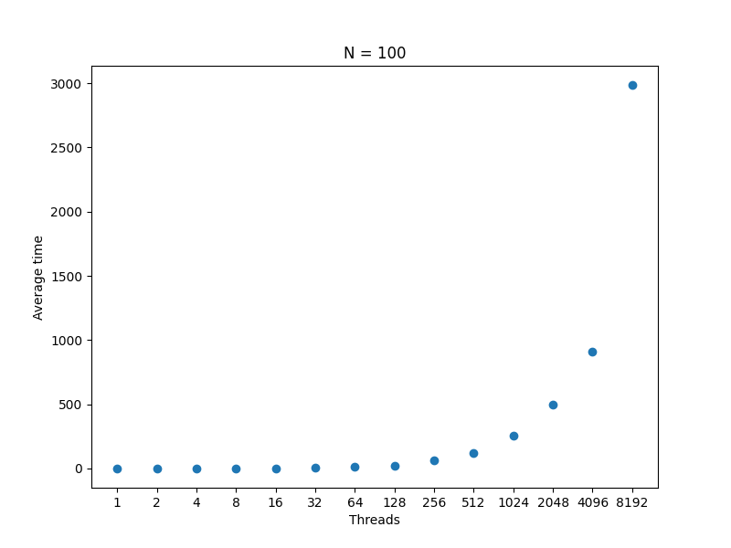
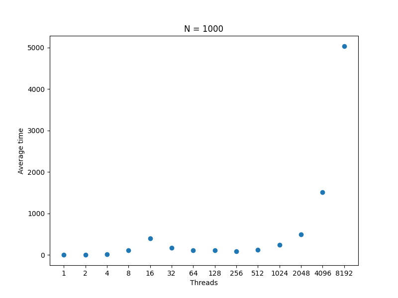
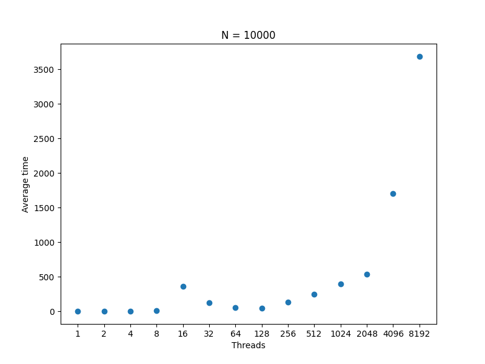
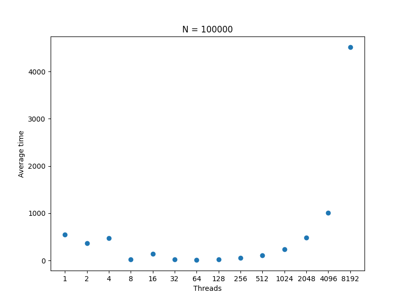
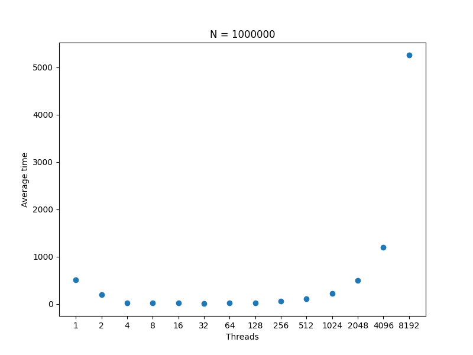
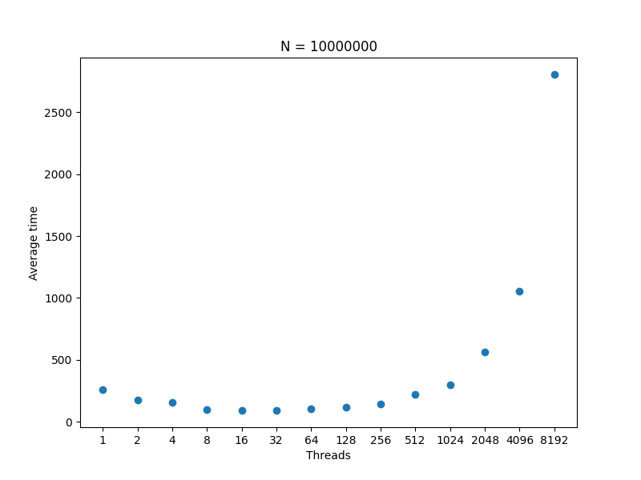
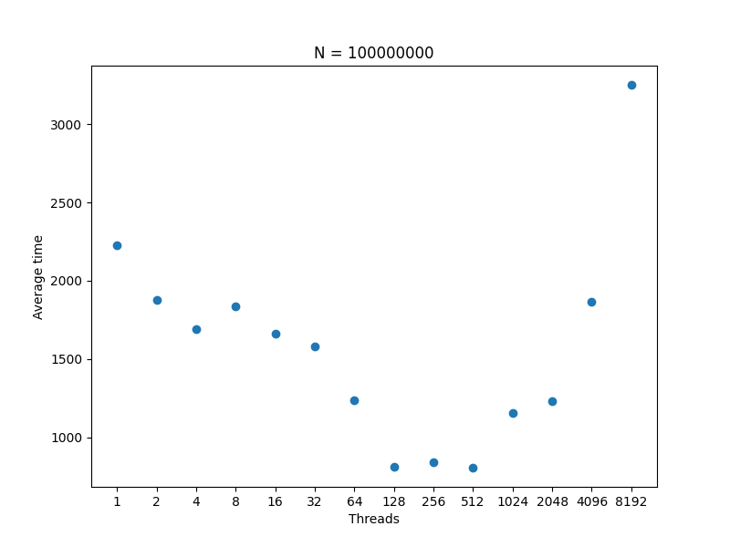
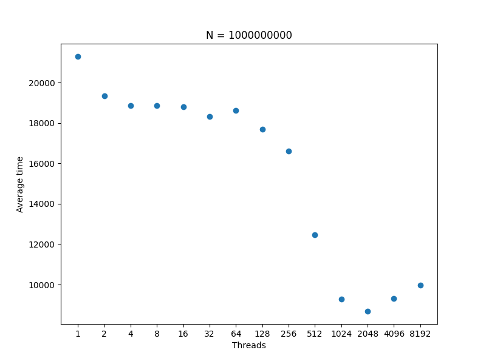

# Performance Results
# Sieve of Eratosthenes method

## N = 100

| Threads | Average Time |
|---------|--------------|
| 1       | 1ms          |
| 2       | 0ms          |
| 4       | 1ms          |
| 8       | 2ms          |
| 16      | 3ms          |
| 32      | 8ms          |
| 64      | 12ms         |
| 128     | 23ms         |
| 256     | 62ms         |
| 512     | 120ms        |
| 1024    | 256ms        |
| 2048    | 498ms        |
| 4096    | 910ms        |
| 8192    | 2987ms       |

## N = 1,000

| Threads | Average Time |
|---------|--------------|
| 1       | 4ms          |
| 2       | 4ms          |
| 4       | 11ms         |
| 8       | 114ms        |
| 16      | 403ms        |
| 32      | 167ms        |
| 64      | 112ms        |
| 128     | 106ms        |
| 256     | 89ms         |
| 512     | 126ms        |
| 1024    | 249ms        |
| 2048    | 495ms        |
| 4096    | 1516ms       |
| 8192    | 5032ms       |

## N = 1,0000

| Threads | Average Time |
|---------|--------------|
| 1       | 1ms          |
| 2       | 3ms          |
| 4       | 2ms          |
| 8       | 6ms          |
| 16      | 365ms        |
| 32      | 127ms        |
| 64      | 58ms         |
| 128     | 46ms         |
| 256     | 131ms        |
| 512     | 250ms        |
| 1024    | 398ms        |
| 2048    | 535ms        |
| 4096    | 1700ms       |
| 8192    | 3686ms       |

## N = 100,000

| Threads | Average Time |
|---------|--------------|
| 1       | 552ms        |
| 2       | 361ms        |
| 4       | 473ms        |
| 8       | 20ms         |
| 16      | 139ms        |
| 32      | 21ms         |
| 64      | 11ms         |
| 128     | 23ms         |
| 256     | 55ms         |
| 512     | 105ms        |
| 1024    | 235ms        |
| 2048    | 488ms        |
| 4096    | 1010ms       |
| 8192    | 4516ms       |

## N = 1,000,000

| Threads | Average Time |
|---------|--------------|
| 1       | 515ms        |
| 2       | 199ms        |
| 4       | 24ms         |
| 8       | 17ms         |
| 16      | 18ms         |
| 32      | 10ms         |
| 64      | 27ms         |
| 128     | 27ms         |
| 256     | 63ms         |
| 512     | 109ms        |
| 1024    | 217ms        |
| 2048    | 500ms        |
| 4096    | 1193ms       |
| 8192    | 5257ms       |

## N = 10,000,000

| Threads | Average Time |
|---------|--------------|
| 1       | 256ms        |
| 2       | 173ms        |
| 4       | 158ms        |
| 8       | 97ms         |
| 16      | 91ms         |
| 32      | 94ms         |
| 64      | 107ms        |
| 128     | 119ms        |
| 256     | 142ms        |
| 512     | 222ms        |
| 1024    | 298ms        |
| 2048    | 565ms        |
| 4096    | 1057ms       |
| 8192    | 2807ms       |

## N = 100,000,000

| Threads | Average Time |
|---------|--------------|
| 1       | 2226ms       |
| 2       | 1878ms       |
| 4       | 1693ms       |
| 8       | 1837ms       |
| 16      | 1663ms       |
| 32      | 1582ms       |
| 64      | 1237ms       |
| 128     | 809ms        |
| 256     | 841ms        |
| 512     | 806ms        |
| 1024    | 1154ms       |
| 2048    | 1231ms       |
| 4096    | 1868ms       |
| 8192    | 3251ms       |

## N = 1,000,000,000

| Threads | Average Time |
|---------|--------------|
| 1       | 21302ms      |
| 2       | 19362ms      |
| 4       | 18868ms      |
| 8       | 18857ms      |
| 16      | 18809ms      |
| 32      | 18334ms      |
| 64      | 18615ms      |
| 128     | 17696ms      |
| 256     | 16622ms      |
| 512     | 12474ms      |
| 1024    | 9268ms       |
| 2048    | 8678ms       |
| 4096    | 9318ms       |
| 8192    | 9960ms       |

